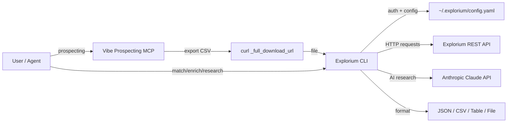
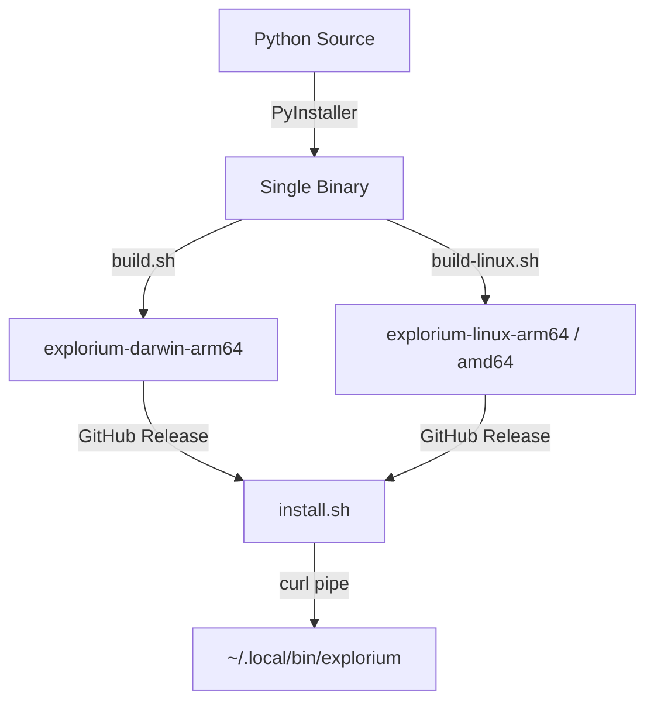

# Explorium CLI — Project Architecture

> [!abstract] What Is This?
> A Python CLI tool that wraps the [Explorium B2B data API](https://api.explorium.ai/v1) into a single `explorium` binary. It handles **matching**, **enrichment**, **prospect search within known companies**, and **AI research**. For open-ended prospecting (discovering companies/people), use the **Vibe Prospecting MCP** connector, then export and enrich with this CLI. Version ==1.4.8==.

---

## High-Level Flow



> [!tip] Tool Division
> - **Vibe Prospecting MCP** — searching for and discovering companies/prospects
> - **Explorium CLI** — matching, enrichment, prospect search within known companies, AI research, events

The typical workflow is:

```
Prospect (Vibe Prospecting) → Export → Download (curl) → Enrich (CLI) → Export (CSV)
```

Commands can be piped together using `-o csv` and `-f -` (stdin):

```bash
# After downloading from Vibe Prospecting:
explorium businesses enrich-file -f companies.csv --types tech -o csv 2>/dev/null \
  | explorium prospects search -f - --job-level cxo -o csv 2>/dev/null \
  | explorium prospects enrich-file -f - --types contacts -o csv \
  > final_results.csv
```

---

## Repository Structure

```
explorium-cli/
├── explorium_cli/            # Main Python package (~8,700 lines)
│   ├── main.py               # Click entry point — registers all command groups
│   ├── __init__.py            # Version string (1.4.6)
│   ├── config.py              # YAML config loader (~/.explorium/config.yaml)
│   ├── api/                   # API client layer
│   │   ├── client.py          # Base HTTP client — retries, backoff, auth
│   │   ├── businesses.py      # /businesses/* endpoints
│   │   ├── prospects.py       # /prospects/* endpoints
│   │   └── webhooks.py        # /webhooks/* endpoints
│   ├── commands/              # Click command groups
│   │   ├── businesses.py      # 1,101 lines — match, search, enrich, events
│   │   ├── prospects.py       # 1,019 lines — match, search, enrich, events
│   │   ├── research_cmd.py    # AI-powered company research
│   │   ├── config_cmd.py      # config init/show/set
│   │   └── webhooks.py        # webhook CRUD
│   ├── batching.py            # CSV/JSON parsing, batch splitting (50/batch)
│   ├── pagination.py          # Auto-paginate API responses (--total flag)
│   ├── parallel_search.py     # Fan-out one search per business ID
│   ├── concurrency.py         # ThreadPoolExecutor wrapper
│   ├── match_utils.py         # Resolve name/domain/linkedin → ID
│   ├── formatters.py          # JSON/CSV/table output + Rich tables
│   ├── constants.py           # Valid enum values (departments, job levels)
│   ├── validation.py          # Client-side filter validation + fuzzy match
│   ├── ai_client.py           # Anthropic SDK wrapper (research + polish)
│   ├── research.py            # Research orchestration (async fan-out)
│   └── utils.py               # Shared Click decorators and helpers
├── tests/                     # 22 test files (pytest)
├── tickets/                   # PRDs and bug tickets (7 files)
├── skills/                    # Claude Code skill definitions
├── plugin/                    # Claude Code plugin (skill + commands-reference)
├── build.sh                   # macOS PyInstaller build script
├── build-linux.sh             # Linux PyInstaller build script
├── install.sh                 # curl-pipe installer (GitHub releases)
├── explorium.spec             # PyInstaller spec (macOS)
├── dist/                      # Built binaries
├── pyproject.toml             # Package metadata + dependencies
└── requirements.txt           # Pinned dependencies
```

---

## Core Modules

### Entry Point — `main.py`

The CLI is a [[Click]] group. Global options (`-o`, `--output-file`, `--threads`, `-c`) are parsed here and stashed in `ctx.obj`. Five command groups are registered:

| Group | Module | Description |
|-------|--------|-------------|
| `config` | `config_cmd.py` | `init`, `show`, `set` |
| `businesses` | `businesses.py` | match, search, enrich (16 types), bulk-enrich, enrich-file, lookalike, autocomplete, events |
| `prospects` | `prospects.py` | match, search, enrich (contacts/profile/social), bulk-enrich, enrich-file, autocomplete, statistics, events |
| `webhooks` | `webhooks.py` | CRUD for webhook endpoints |
| `research` | `research_cmd.py` | AI-powered company research using Claude |

### API Client — `api/client.py`

> [!info] Authentication
> Uses `API_KEY` header (not Bearer). Key is loaded from `~/.explorium/config.yaml` or `EXPLORIUM_API_KEY` env var.

- Base class `ExploriumAPI` with `get()`, `post()`, `put()`, `delete()`
- ==Automatic retries== with exponential backoff for `{429, 500, 502, 503, 504}`
- Per-thread `requests.Session` via `threading.local()`
- All API errors wrapped in `APIError` with status code + response body

### Batching — `batching.py`

The largest utility module (835 lines). Handles:

- **CSV/JSON auto-detection** — peeks at first byte (`[` or `{` = JSON, else CSV)
- **Column alias mapping** — `company_name` → `name`, `website` → `domain`, etc.
- **Batch splitting** — chunks of 50 for bulk match/enrich API calls
- **Input merging** — merges enrichment results back with `input_` prefixed columns
- **LinkedIn URL normalization** — strips query params, trailing slashes

### Concurrency — `concurrency.py` + `parallel_search.py`

- `concurrent_map()` — generic `ThreadPoolExecutor` wrapper, preserves input order
- `parallel_prospect_search()` — fans out one search per business ID, deduplicates results
- Default concurrency: 5 threads (configurable via `--threads`)

### Output — `formatters.py`

Three output modes routed through a single `output()` function:

| Mode | Library | Notes |
|------|---------|-------|
| `json` | stdlib `json` | Pretty-printed, piped to `jq` |
| `table` | `rich` | Rich tables with column headers |
| `csv` | stdlib `csv` | Flattens nested dicts with `.` separator |

`--output-file` writes clean data to disk; `--summary` stats go to stderr.

### Match Resolution — `match_utils.py`

Resolves human-readable identifiers to API IDs:

```
name + domain → POST /businesses/match → business_id
first_name + last_name + company → POST /prospects/match → prospect_id
linkedin URL → POST /prospects/match → prospect_id
```

Includes confidence scoring with a default threshold of `0.8` and suggestion display for low-confidence matches.

### AI Research — `ai_client.py` + `research.py`

> [!note] Requires Anthropic API Key
> Set via `ANTHROPIC_API_KEY` env var. Uses `claude-sonnet-4-6` for research and `claude-haiku-4-5` for validation.

Two-phase flow:
1. **Prompt polishing** — rewrites user's raw question into a structured research prompt (skippable with `--no-polish`)
2. **Parallel research** — async fan-out using `asyncio` + Anthropic's `AsyncAnthropic` client, one call per company

Output format per company: `research_answer`, `research_reasoning`, `research_confidence`

### Validation — `constants.py` + `validation.py`

Client-side enum validation for `--department` and `--job-level` filters:

- Exact match against known valid values
- Alias resolution (e.g., `"Information Technology"` → `"it"`)
- Fuzzy substring matching
- `difflib.get_close_matches()` for "did you mean?" suggestions
- ==Soft validation== — unknown values warn but still pass through to API

---

## Build & Distribution



- **PyInstaller** bundles everything into a single `explorium` executable (~onefile mode)
- Excludes heavy packages: numpy, pandas, matplotlib, tkinter, scipy, PIL
- `install.sh` — curl-pipe installer that detects OS/arch, downloads from GitHub releases, installs to `~/.local/bin/`
- Also installs the **Claude Code skill** files to `~/.claude/skills/explorium-cli/`

### Supported Platforms

| Platform | Architecture | Binary Name |
|----------|-------------|-------------|
| macOS | arm64 (Apple Silicon) | `explorium-darwin-arm64` |
| Linux | amd64 / x86_64 | `explorium-linux-amd64` |
| Linux | arm64 / aarch64 | `explorium-linux-arm64` |

---

## Configuration

Config is loaded with this priority (highest wins):

1. Environment variables (`EXPLORIUM_API_KEY`, `EXPLORIUM_BASE_URL`, etc.)
2. CLI flag (`-c /path/to/config.yaml`)
3. Default file (`~/.explorium/config.yaml`)
4. Hardcoded defaults

```yaml
# ~/.explorium/config.yaml
api_key: "your-key"
base_url: "https://api.explorium.ai/v1"
default_output: "json"
default_page_size: 100
```

---

## Dependencies

| Package | Purpose |
|---------|---------|
| `click` >= 8.0 | CLI framework (commands, options, groups) |
| `rich` >= 13.0 | Table formatting, colored output |
| `pyyaml` >= 6.0 | Config file parsing |
| `requests` >= 2.31 | HTTP client for Explorium API |
| `python-dotenv` >= 1.0 | `.env` file loading |
| `anthropic` >= 0.40 | Claude API for research commands |

Dev: `pytest` + `pytest-cov`

---

## Testing

22 test files covering:

| Test File | What It Tests |
|-----------|---------------|
| `test_client.py` | API client retries, error handling |
| `test_api_businesses.py` | Business API endpoint calls |
| `test_api_prospects.py` | Prospect API endpoint calls |
| `test_batching.py` | CSV parsing, batch splitting, column aliases |
| `test_formatters.py` | JSON/CSV/table output formatting |
| `test_pagination.py` | Auto-pagination logic |
| `test_parallel_search.py` | Fan-out search, deduplication |
| `test_concurrency.py` | Thread pool executor |
| `test_match_utils.py` | Name → ID resolution, confidence |
| `test_search_filters.py` | 49 tests for all search filter options |
| `test_filter_validation.py` | Enum validation, aliases, fuzzy match |
| `test_null_prospect_handling.py` | Null ID filtering in batches |
| `test_research.py` | Research orchestration |
| `test_research_errors.py` | Fail-fast, API key validation |
| `test_cli_integration.py` | End-to-end CLI invocation |
| `test_documentation_examples.py` | Validates examples from docs work |

Run with:

```bash
pytest tests/ -v
```

---

## Claude Code Integration

The CLI ships with a **Claude Code skill** and **plugin** so AI agents can use it:

- `skills/SKILL.md` — Skill definition for the `explorium-cli` skill
- `plugin/skills/explorium-cli/SKILL.md` — Plugin-packaged skill
- `plugin/skills/explorium-cli/commands-reference.md` — Full CLI reference for agents
- `install.sh` also copies skills to `~/.claude/skills/explorium-cli/`

---

## Known Issues & Tickets

> [!todo] Open Tickets
> See the [[tickets]] folder for full details.

| Ticket | Summary | Severity |
|--------|---------|----------|
| [[PRD-1_Null-Prospect-ID-Handling\|PRD-1]] | Null `prospect_id` in batches causes silent 100% data loss | Critical |
| [[PRD-2_Research-Run-Output-And-Error-Handling\|PRD-2]] | `research run` ignores `-o`/`--output-file`, no fail-fast on bad API key | High |
| [[PRD-3_Filter-Value-Validation\|PRD-3]] | Invalid filter values waste N API calls before failing | High |
| [[ticket-prospects-search-total-pagesize\|Search --total bug]] | `--total` + filters causes 422 (`size >= page_size`) | High |
| [[add-422-to-retryable-status-codes\|422 Retry]] | Transient 422s should be retryable | Medium |
| [[JIRA-cli-documentation-improvements\|Doc improvements]] | `bulk-enrich` docs mislead into unnecessary ID extraction | Medium |
| [[explorium-cli-tickets\|Tickets Overview]] | 4 enrichment & usability improvements from real workflow | Mixed |

---

## Key Design Patterns

> [!tip] Patterns to Know

- **Vibe Prospecting for discovery, CLI for enrichment** — Prospecting (finding companies/people) goes through Vibe Prospecting MCP; matching, enrichment, and research go through the CLI
- **Pipeline-first** — Every command supports `-o csv` and `-f -` (stdin) for piping
- **Match-or-ID** — All enrichment commands accept either an ID or match params (name/domain/linkedin)
- **Batch everything** — File operations auto-batch in groups of 50
- **Warnings to stderr** — Progress, summaries, and warnings go to stderr; clean data goes to stdout
- **Soft validation** — Filter values are validated locally but unknown values still pass through to the API
- **Thread-based concurrency** — `ThreadPoolExecutor` for parallel API calls (not asyncio, except for research)
